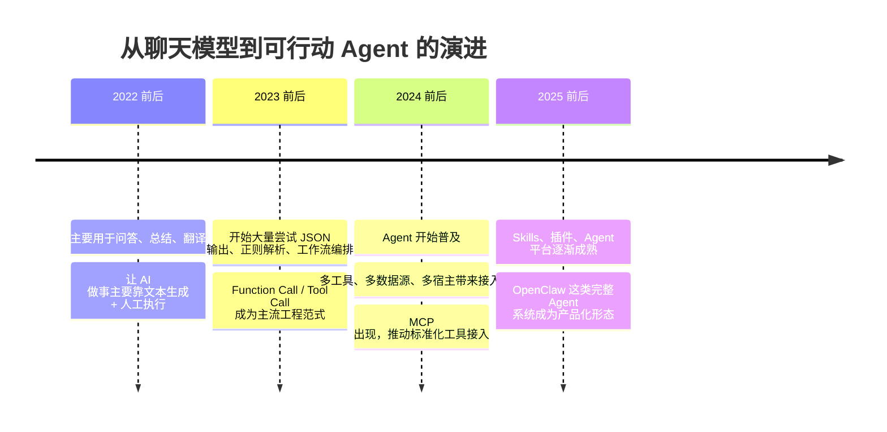
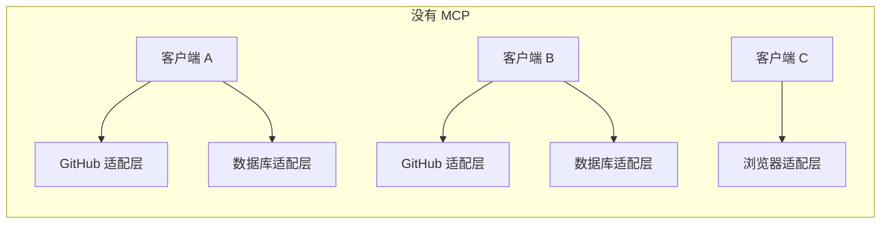
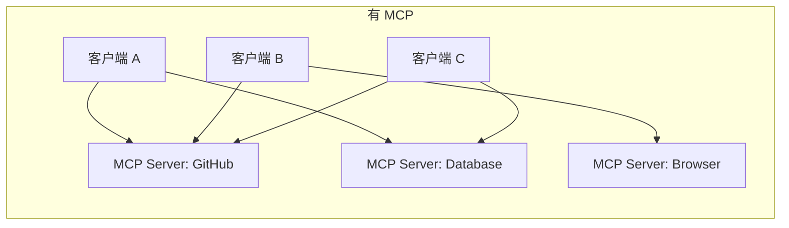
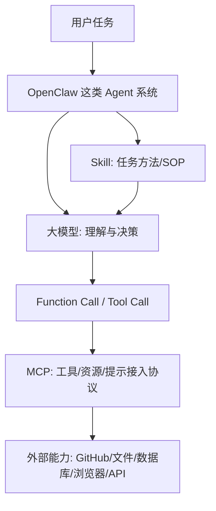
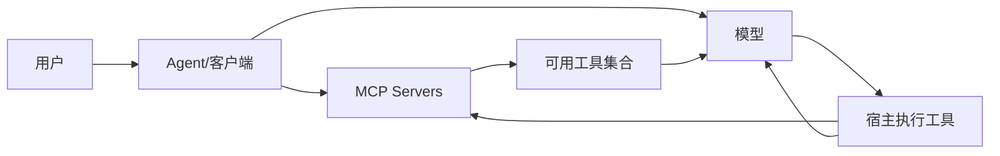

> 这篇文章试图回答一个经常把人绕晕的问题：`大模型`、`Function Call`、`MCP`、`Skill`、`OpenClaw` 到底各自处在什么层？它们是替代关系，还是协作关系？为什么这套东西会在近几年按这样的顺序出现？

---

## 1. 引子：为什么这些词总是容易混在一起

在今天的 AI 圈里，几个词几乎天天会被同时提起：

- 大模型（LLM, Large Language Model）
- Function Call / Tool Call
- MCP（Model Context Protocol）
- Skill
- OpenClaw

它们看上去像是在说同一件事，实际上并不是。

造成混乱的原因很简单：这些词都和“让 AI 真正做事”有关，但它们处在不同层级。

- `大模型` 解决的是“理解和推理”
- `Function Call` 解决的是“模型如何发起一次结构化动作”
- `MCP` 解决的是“外部能力如何被标准化接入和复用”
- `Skill` 解决的是“某类任务应该如何更稳定地完成”
- `OpenClaw` 这样的项目，解决的是“如何把模型、工具、工作流和界面整合成一个真正可用的 Agent 系统”

如果只记一句话，可以先记这个：

> `Function Call` 管调用，`MCP` 管接入，`Skill` 管方法，`OpenClaw` 管整合。

这篇文章会按时间线来讲，而不是只给静态定义。因为只有把历史脉络串起来，你才会知道：

- 为什么最开始没有 Function Call
- 为什么后来必须引入 Function Call
- 为什么有了 Function Call 之后，还会继续出现 MCP
- 为什么 MCP 并没有把 Function Call “替换掉”
- 为什么 Skill 和 OpenClaw 又属于另一层

为了让这条主线不只是停留在抽象概念上，文中还会穿插一条人物支线。

主人公叫小明，他是一名嵌入式软件工程师。  
他平时要做的事情很典型：

- 阅读芯片手册和协议文档
- 写驱动和板级初始化代码
- 调串口日志、看寄存器、抓波形
- 分析 bug，修时序问题、内存问题和中断问题
- 和硬件、测试、上位机同学反复联调

你可以把他理解成一个很适合观察 AI 演进的人物样本。因为嵌入式开发既有大量文本工作，也有大量真实世界约束：

- 代码要和硬件对上
- 调试要基于日志、示波器、手册和板子状态
- 很多问题不是“写一段漂亮文字”就能解决的

所以，小明这条支线会帮助我们看清一件事：

> AI 的每一次能力升级，究竟给一个具体工程师的工作带来了什么变化。

先上整篇文章的总览图。



**这一阶段的核心结论**

这些词不是同义词，而是 AI 应用从“会说”走向“会做”过程中，不同阶段冒出来的解决方案。

---

## 2. 没有 Function Call 的时代：人们最初是怎么利用大模型的

大模型最早大规模进入大众视野时，最强的能力其实不是“执行”，而是“表达”。

当时人们主要把它当成下面几类工具：

- 问答系统
- 文本总结器
- 翻译器
- 改写和润色工具
- 头脑风暴伙伴
- 代码建议器

那时的模型很像一个极强的“语言引擎”。它能把信息重新组织、解释、生成，但它通常并不能真正去操作外部世界。

### 2.1 最早的典型用法：AI 负责生成，人负责执行

在没有 Function Call 的阶段，最常见的工作模式其实是：

1. 用户提出问题或任务
2. 模型生成一段建议、命令、SQL、脚本或步骤
3. 人类自己复制、检查并执行

比如：

- “帮我写一个 SQL 查出过去 7 天新增订单”
- “帮我生成一个 curl 请求去调这个 API”
- “帮我写个 bash 脚本备份日志”
- “帮我写封邮件通知客户延期”

这个阶段里，AI 像一个非常能干的实习生：它会出主意、会写草稿、会给方案，但最后还是你自己去按按钮。

### 2.2 当时常见的三种“让 AI 参与做事”的办法

虽然没有 Function Call，但大家并不是完全没想办法让 AI 接入业务系统。常见做法大概有三类。

#### 方法一：纯文本指令 + 人工接力

这是最原始也最常见的一种。

模型输出：

- 一段 shell 命令
- 一段 SQL
- 一段 Python 代码
- 一段 API 请求说明

人类再去执行。

优点很明显：

- 简单
- 没有工程门槛
- 几乎不需要额外系统支持

缺点也很明显：

- 无法自动化闭环
- 容易出错
- 无法稳定扩展到复杂业务流程

#### 方法二：把 LLM 当成某个工作流中的一个步骤

这一类方案并不要求模型自己“调工具”，而是由外部系统决定什么时候调用模型。

例如：

- 客服系统先把用户消息送给 LLM 分类
- LLM 判断“退款 / 投诉 / 咨询”
- 后端程序根据分类结果走固定流程

在这种模式下，模型是整个工作流中的一个智能节点，而不是调度者。

优点：

- 稳
- 好控
- 易审计

缺点：

- 模型没有主动使用工具的能力
- 灵活性差
- 多工具任务要靠外部系统写死流程

#### 方法三：规则系统或脚本硬编码调用逻辑

更进一步的团队会这样做：

- 给模型一个提示词模板
- 规定它按某种格式输出
- 解析输出结果
- 再由代码决定调用哪个系统

例如，工程里会出现类似这样的约定：

```text
如果模型输出 ACTION:SEARCH_WEATHER(city=Shanghai)
那后端就去调用天气 API
```

这已经很接近 Function Call 的精神了，但它还不是标准的 Function Call，因为：

- 调用语法是自己发明的
- 解析规则是自己维护的
- 参数是否合法要自己兜底
- 换个模型、换个团队，语法就变了

### 2.3 为什么这种阶段迟早会碰到天花板

一旦人们希望 AI 不只是“说得对”，而是“真的帮我把事做完”，问题就来了。

这个阶段会碰到几个非常现实的瓶颈：

- 模型输出不稳定
- 文本格式很容易漂
- 人工复制执行无法扩展
- 没有统一的安全边界
- 多工具联动很难做
- 稍复杂的任务需要很多“胶水代码”

简单说，早期的大模型非常擅长“生成下一段文字”，但不擅长“发起一个可靠、可验证、可审计的动作”。

这就为 Function Call 的出现埋下了伏笔。

### 2.4 支线：小明在这个阶段是怎么工作的

如果把镜头拉到小明身上，这个阶段的变化会非常真实。

在还没有大模型的时候，小明的工作节奏大概是这样的：

1. 看需求文档和芯片手册
2. 在工程里搜索类似模块的旧代码
3. 自己写驱动初始化、寄存器配置和中断处理
4. 编译、烧录、连串口
5. 观察日志、修改代码、再次烧录
6. 遇到疑难问题时，翻论坛、看 datasheet、请教同事

这是一个非常“手工”的工作流。  
小明的时间主要花在三类事上：

- 找资料
- 写和改代码
- 反复验证

后来有了大模型，小明的工作并没有立刻自动化，但开始出现了明显变化。

他会把大模型当成一个随叫随到的技术助手，例如：

- “帮我解释一下这个 I2C 初始化序列可能哪里有问题”
- “根据这个寄存器定义，帮我写一段 C 语言位操作宏”
- “把这段英文 errata 总结成中文要点”
- “看一下这段串口日志，帮我猜测可能是哪几类问题”

这时候，小明的效率确实提高了，但提高的主要是：

- 理解资料的速度
- 写模板代码的速度
- 排查思路展开的速度

还没有真正改变的一点是：

> 板子还是得他自己烧，日志还是得他自己看，寄存器还是得他自己读，最终动作仍然由人来完成。

这恰好对应了那个时代的大模型定位：它已经能大幅增强“思考和表达”，但还没有稳定接管“动作和执行”。

**延伸阅读**

- OpenAI function calling guide: <https://platform.openai.com/docs/guides/function-calling>
- OpenAI tools guide: <https://platform.openai.com/docs/guides/tools?api-mode=responses>

**这一阶段的核心结论**

没有 Function Call 的时代，AI 主要是“高质量文本生成器”。它能指导工作，但通常还不是工作流里真正可靠的动作执行入口。

---

## 3. 为什么会出现 Function Call：当“会说”不够用了

当大模型开始被放进真实业务系统后，需求很快升级了。

用户不再只问：

- “这个概念是什么？”
- “帮我改写一下这段话”

而是开始问：

- “帮我查一下今天的汇率”
- “帮我从 CRM 里找出这个客户”
- “帮我创建一个 Jira 任务”
- “帮我发一封确认邮件”
- “帮我订一个明天下午的会议”

注意，这些需求和前一阶段最大的不同在于：它们需要接入外部系统。

模型光会说，不够了。它必须有一种稳定方式来表达：

> 我现在需要调用哪个工具，以及要传什么参数。

### 3.1 Function Call 出现前的几种过渡方案

在正式的 Function Call 范式流行之前，行业里其实试过很多办法。

#### 方案一：让模型输出固定 JSON

这是最自然的一种想法。

比如规定模型必须输出：

```json
{
  "action": "get_weather",
  "city": "Shanghai"
}
```

然后程序去解析 JSON 再执行。

这比纯文本已经强很多，但仍然有不少问题：

- 模型不一定总输出合法 JSON
- 参数类型约束不清晰
- 多工具扩展后 schema 管理混乱
- 错误恢复很痛苦

#### 方案二：正则解析或模板匹配

这类方案会要求模型输出某种字符串：

```text
CALL:get_weather(city=Shanghai)
```

然后后端用正则解析。

优点是开发快，缺点是工程寿命通常不长。因为只要模型输出稍微漂一下，解析就坏了。

#### 方案三：XML / DSL / 标签语法

有些团队会设计一种更“像协议”的写法，例如：

```xml
<tool name="get_weather">
  <arg name="city">Shanghai</arg>
</tool>
```

或者设计自定义 DSL。

这些办法比正则更强，但问题仍然类似：

- 语法是私有的
- 成本仍在应用侧
- 缺少行业共识
- 跨模型和跨平台迁移困难

### 3.2 为什么最后大家收敛到了 Function Call

Function Call 能成为主流，不是因为它唯一，而是因为它在工程上最平衡。

它带来了几个重要变化。

#### 第一，动作变成了显式结构，而不是隐式文本

过去模型只能“说一段话，暗示你去做什么”。

现在模型可以明确表示：

- 我要调用 `get_weather`
- 参数是 `{ city: "Shanghai" }`

这让“说话”和“做事”第一次被工程化地分开了。

#### 第二，参数开始受 schema 约束

一旦工具有 schema，系统就能做很多原来做不了的事：

- 校验参数是否合法
- 限定字段类型
- 控制可调用工具集合
- 让宿主程序有更清晰的执行边界

#### 第三，执行权仍然在宿主程序，而不在模型手里

这一点非常重要。

Function Call 并不是“模型直接运行代码”。  
它只是让模型发出一个结构化请求。

真正的执行者仍然是：

- 你的应用
- 你的后端
- 你的 Agent 宿主

这意味着：

- 权限可以控制
- 审计可以保留
- 风险可以隔离
- 错误可以回传

#### 第四，它非常适合多轮闭环

一个成熟的工具调用流程通常是：

1. 用户提问
2. 模型决定调用工具
3. 宿主执行工具
4. 把结果返回模型
5. 模型基于结果继续回答或继续调用下一个工具

这比单次文本生成强得多，因为它让模型开始像一个“会借助外部能力思考的人”。

### 3.3 一个简化的 Function Call 心智模型

你可以把 Function Call 想成人体里的“动作指令”。

- 大脑负责想
- 手负责拿手机
- 嘴负责说话
- 腿负责走路

Function Call 就像：

> 大脑决定：现在让右手去拿手机。

它不是神经系统本身，也不是手机本身，而是一次明确的动作调度。

**延伸阅读**

- OpenAI function calling lifecycle: <https://platform.openai.com/docs/guides/function-calling/lifecycle>
- OpenAI tools overview: <https://platform.openai.com/docs/guides/tools?api-mode=responses>

**这一阶段的核心结论**

Function Call 的出现，标志着大模型从“高质量文本生成器”进化为“能够发起可靠动作请求的决策器”。

### 3.4 支线：Function Call 到来后，小明的工作哪里开始真正变化

对于小明这种嵌入式工程师来说，Function Call 带来的变化，不是“AI 终于什么都会了”，而是“AI 开始能把建议变成可触发的动作链条”。

在没有 Function Call 时，小明可能会这样工作：

- 让模型生成一段 `openocd` 命令
- 让模型写一个 Python 串口解析脚本
- 让模型给出 GDB 调试步骤
- 然后自己复制到终端执行

有了 Function Call 之后，理想中的工作流开始变成：

1. 小明说：“帮我分析这块板子启动失败的原因”
2. 模型先调用日志读取工具
3. 再调用编译产物分析工具
4. 再调用文档检索工具查询芯片手册
5. 最后给出一个结合上下文的判断

这一步的关键变化在于，小明不再只是拿 AI 生成的一段文字去手工接力，而是开始看到：

- AI 可以先查日志
- 可以先读文档
- 可以先看构建结果
- 再把这些结果组织成结论

对小明来说，工作体验的变化是：

- 以前是“AI 给建议，我自己操作”
- 后来变成“AI 可以先帮我跑几步，再回来告诉我判断”

虽然真正烧录板子、控制实验设备这类动作在很多场景里仍然需要很谨慎的权限控制，但至少从软件世界的视角看，AI 已经从“顾问”向“助手”跨了一步。

---

## 4. 为什么最终是 Function Call / Tool Call 成为主流范式

看到这里，很自然会问一句：

为什么最后流行的是 Function Call，而不是别的方案？

答案不是“技术上只能这样”，而是“它是最容易在现实中推广的那个折中方案”。

### 4.1 它解决了文本生成和系统执行之间的分工问题

模型最擅长的是：

- 理解语义
- 归纳信息
- 在多种候选动作中做选择

宿主程序最擅长的是：

- 权限控制
- 工具执行
- 状态管理
- 日志和审计

Function Call 正好把这两部分拆开：

- 模型负责“决定要做什么”
- 程序负责“真正把事情做掉”

这个边界很清晰，所以容易落地。

### 4.2 它比“只靠工作流”更灵活

如果完全不用 Function Call，只靠工作流编排，也能做很多事。

例如：

- 固定流程审批
- 固定客服路由
- 固定报表生成

但问题是，一旦任务变得开放，例如：

- 先查文档，再查数据库，再发邮件，再总结

纯工作流方案就会变得僵硬，因为你必须在系统里提前写死大量路径。

Function Call 的好处是：模型可以根据上下文动态选择工具，而不是只能走预设分支。

### 4.3 它比私有 DSL 更容易形成生态

如果每家公司都发明一套：

- `<tool>` 标签
- `ACTION:xxx` 协议
- 私有 JSON 格式

那结果就是生态碎片化。

Function Call / Tool Call 的价值之一，就是让行业开始逐步收敛到一套共同语言：

- 工具有名字
- 参数有 schema
- 调用是显式动作
- 结果会回传模型

今天不同平台在命名上可能有细微差异，但核心心智模型已经高度相似。

### 4.4 它不是“唯一方案”，而是“主流基座”

这一点很值得强调。

今天依然存在很多不用 Function Call 的 AI 系统，例如：

- 纯 RAG 问答系统
- 纯工作流驱动系统
- 只把模型当分类器或摘要器的系统
- 只在 UI 层使用 AI 生成文案的产品

所以更准确的说法是：

> Function Call 不是所有 AI 应用的唯一方法，但它已经成为“让模型调用外部能力”的主流基座。

**这一阶段的核心结论**

Function Call 之所以成为主流，不是因为它最炫，而是因为它在灵活性、可控性、扩展性和生态共识之间取得了最好的平衡。

---

## 5. 没有 MCP 的时代：Agent 和工具接入是怎么开发的

当 Function Call 已经比较成熟后，新的问题又出现了。

问题不再是：

> 模型怎么发起调用？

而变成了：

> 这些工具到底从哪里来？怎么接？怎么复用？怎么跨平台共享？

这时，行业进入了“工具调用已经有了，但工具接入还很混乱”的阶段。

### 5.1 典型工程形态：每个客户端各接各的工具

在没有 MCP 的时代，一个典型 Agent 项目通常会这样开发：

- 为 OpenAI 写一套工具定义
- 为 Anthropic 写一套适配层
- 为 IDE 插件写一套本地桥接
- 为桌面应用写一套插件接口
- 为浏览器 Agent 再写一套连接逻辑

同一个“查 GitHub issue”能力，可能被包装了很多次。

这带来几个直接问题：

- 重复开发
- 重复维护
- 不同平台行为不一致
- 工具元数据难统一
- 权限模型不统一

### 5.2 工具定义往往散落在应用代码里

在那个阶段，工具常常是这样存在的：

- 一部分直接写在后端代码中
- 一部分挂在某个插件系统里
- 一部分封在 SDK 里
- 一部分藏在工作流平台里

换句话说，Function Call 解决了“模型怎么说我要调用工具”，却没有解决“工具作为能力资产，怎么被标准化地暴露出来”。

### 5.3 多宿主时代的痛点开始集中爆发

一旦 Agent 不再只是一个网页聊天框，而开始进入：

- IDE
- 桌面应用
- 浏览器扩展
- 协作平台
- 企业内部工具

问题会突然放大。

因为不同宿主都想接入：

- 文件系统
- GitHub
- 数据库
- 浏览器
- 内部 API
- 知识库

如果没有统一接入层，每个宿主都会重复造轮子。

### 5.4 你现在这类配置文件，其实就是标准化需求的一个缩影

以你当前打开的 `cline_mcp_settings.json` 为例：

```json
{
  "mcpServers": {
    "fetch": {
      "args": ["mcp-server-fetch"],
      "command": "uvx"
    },
    "bibigpt": {
      "type": "http",
      "url": "https://bibigpt.co/api/mcp"
    }
  }
}
```

这个配置背后隐含的思想是：

- 工具不再直接硬编码在某个模型供应商的接口层里
- 而是先作为一类可连接的外部能力存在
- 客户端通过统一方式接入它们

这正是 MCP 要解决的问题：先把工具“接进来”，再谈模型“怎么用它们”。

**这一阶段的核心结论**

没有 MCP 的时代，Function Call 已经让模型学会“发出动作请求”，但工具接入仍然高度碎片化。Agent 生态需要的，已经不只是调用机制，而是一套统一的连接标准。

### 5.5 支线：没有 MCP 时，小明会遇到什么新的烦恼

Function Call 出现后，小明确实更爽了，但很快又会碰到新的工程现实。

假设他所在团队逐步把一些能力做成了可供 AI 调用的工具：

- 一个工具查构建日志
- 一个工具查测试平台结果
- 一个工具检索硬件设计文档
- 一个工具搜索芯片手册和内部 wiki
- 一个工具读取串口采集文件

听起来已经很先进了，但如果没有 MCP，这些工具通常会有几个问题：

- 在 VS Code 插件里能用，在另一个 Agent 客户端里又得重接一遍
- 在本地调试能用，换到团队共享环境又要重配
- 不同模型供应商下，工具描述和适配代码不完全一样
- 文档检索、日志检索、动作工具各有各的接法

对小明来说，这就会出现一种很典型的落差：

> 明明团队已经做出了很多工具，但它们不够像“基础设施”，更像“某个应用里的零散能力”。

他会发现，自己不是缺工具，而是缺一种稳定的工具接入方式。

这也是为什么到了这个阶段，行业开始从“模型会不会调工具”转向“工具该怎么像积木一样被不同 Agent 共享”。

---

## 6. MCP 的需求是怎么来的：它到底解决了什么问题

MCP 的全名是 `Model Context Protocol`。

如果只用一句话解释它，可以这样说：

> MCP 是一套把外部能力标准化暴露给 AI 客户端的协议。

这里最重要的词是：

- 标准化
- 暴露
- 外部能力
- AI 客户端

### 6.1 MCP 不是“另一个 Function Call”

这是最容易误解的地方。

Function Call 回答的是：

> 模型如何表达“我要调用这个工具”

MCP 回答的是：

> 工具、资源、提示，如何以统一方式被客户端发现、连接和使用

所以它们不是替代关系，而是分工关系。

最常见的真实链路其实是：

1. Agent 客户端先通过 MCP 连接一组外部能力
2. 客户端拿到这些能力的描述
3. 再把可调用部分暴露给模型作为 tools / functions
4. 模型通过 Function Call / Tool Call 来选择使用哪一个

也就是：

- `MCP` 管“接入”
- `Function Call` 管“调用”

### 6.2 MCP 解决了哪些具体问题

#### 第一，工具发现（discovery）

过去如果一个客户端要接某种工具，往往得写死一堆适配逻辑。

有了 MCP 之后，客户端可以更统一地发现：

- 有哪些 tools
- 有哪些 resources
- 有哪些 prompts

这让接入过程更像“插上电源，读取能力清单”，而不是“为每个工具单独硬编码桥接”。

#### 第二，标准化通信

MCP 不只是一个静态描述文件，而是一个协议。

这意味着它不仅描述：

- 工具叫什么
- 参数是什么

还描述了客户端和服务端如何交换信息。

这比“给一份 OpenAPI 文档就完了”更进一步，因为它面向的是 AI 交互场景，而不只是传统应用 API 调用。

#### 第三，跨宿主复用

如果一个 GitHub 工具集按 MCP 暴露出来，那么理论上不同宿主都可以接它：

- 桌面客户端
- IDE Agent
- 浏览器 Agent
- 企业内部 Copilot

这比每个宿主各写一遍插件明显更有生态价值。

#### 第四，不只支持动作，也支持资源和提示

这是 MCP 很有辨识度的一点。

很多人一开始会把“工具协议”理解成“调用 API 的协议”。但 MCP 的视角更完整。

它不只关心：

- 做一个动作

还关心：

- 提供一份资源给模型看
- 提供一类提示模板给宿主复用

这使它不像单纯的函数注册机制，而更像一套面向 Agent 时代的上下文接入协议。

### 6.3 一张图看懂：没有 MCP 和有 MCP 的区别





这两张图的差别就在于：

- 前者是“每个客户端都自己接”
- 后者是“能力先标准化暴露，再被多个客户端复用”

### 6.4 MCP 的出现，是 Agent 生态开始成熟的信号

如果说 Function Call 的出现，标志着模型开始能“开口要工具”；

那么 MCP 的出现，标志着行业开始认真思考：

> 工具不应该只是某个应用里的临时代码，而应该成为一个可复用、可迁移、可组合的生态层。

**延伸阅读**

- MCP 官网：<https://modelcontextprotocol.io/>
- MCP specification：<https://modelcontextprotocol.io/specification/2025-06-18/basic>
- OpenAI MCP overview：<https://platform.openai.com/docs/mcp/overview>

**这一阶段的核心结论**

MCP 的出现，不是为了替掉 Function Call，而是为了给 Agent 时代的工具、资源和提示接入建立统一标准。

### 6.5 支线：MCP 出现后，小明的工作流为什么更像“搭积木”

如果说 Function Call 让小明第一次感受到“AI 会帮我跑几步”，那么 MCP 带来的变化更像：

> 团队终于开始把这些能力做成可复用的积木，而不是一次性的临时接线。

在有了 MCP 之后，小明所在团队可以把常用能力逐步整理成统一接入的服务，例如：

- 构建日志 MCP server
- 文档检索 MCP server
- 测试报告 MCP server
- 缺陷系统 MCP server
- 仪器控制或结果读取 MCP server

这样一来，小明在不同宿主中的体验会开始趋同：

- 在 IDE 里能调的能力，在桌面 Agent 里也更容易复用
- 今天给 Claude 类客户端接的文档工具，明天给别的 Agent 接也不用重做一整套
- 新接一个知识库，不必从头改一堆模型工具适配代码

对小明而言，最直观的变化不是“多了一个新协议”，而是：

- 以前每加一个能力都像焊一根新飞线
- 现在更像往插座上接一个标准模块

这会让他的团队开始真正沉淀“AI 工程资产”，而不只是做出一堆只能在单点产品里使用的小工具。

---

## 7. 为什么不是别的方案赢，而是 MCP 成为主流协议候选

当行业意识到“工具接入层需要标准化”时，其实并不是只有 MCP 一条路。

### 7.1 备选方向一：继续让各家模型厂商维护私有协议

这是最自然的一条路。

也就是说：

- OpenAI 有自己的工具接入方式
- Anthropic 有自己的方式
- 每个 IDE Agent 也有自己的插件协议

这条路短期最省事，但长期最大的问题是：

- 生态碎片化
- 工具提供方要适配多套协议
- 用户和开发者被锁进单一平台

对于 Agent 生态来说，这会严重阻碍复用。

### 7.2 备选方向二：每个 Agent 框架自己做插件系统

这其实已经发生过，也还在发生。

很多框架都会有自己的：

- 插件机制
- 扩展系统
- 工具注册方式

这些方案在某个产品内部通常很好用，但问题在于：

- 框架之间不能通用
- 能力资产很难迁移
- 生态边界太窄

它们更像“产品内扩展机制”，而不是“跨产品协议”。

### 7.3 备选方向三：只用 OpenAPI / REST 描述工具

有人会问，既然工具最终经常是 API，那为什么不用 OpenAPI？

这是一个很好的问题。

OpenAPI 的优势是：

- 成熟
- 工具链丰富
- 适合描述传统接口

但它不完全适合作为 MCP 的替代品，原因在于：

- 它主要描述 HTTP API，而不是更广义的 Agent 上下文能力
- 它关注接口形状，不天然覆盖 prompts / resources 这类对象
- 它不直接定义 AI 宿主和能力提供方之间的交互语义

所以 OpenAPI 更像“接口描述标准”，而 MCP 更像“AI 能力接入协议”。

### 7.4 备选方向四：继续用更轻量的 JSON schema 注册

还有一种路线是只做一个很轻量的工具注册格式：

- 工具名
- 描述
- 参数 schema

这种方案实现成本低，但覆盖面也窄。

它适合解决：

- “模型怎么知道有哪些工具”

却不太适合系统性解决：

- 资源暴露
- 提示暴露
- 统一会话交互
- 跨宿主复用

### 7.5 为什么 MCP 看起来更像“正确的中间层”

MCP 能成为主流候选，是因为它刚好卡在一个很关键的位置上：

- 不属于某家模型厂商
- 不属于某个单独产品
- 又不只是一个静态 schema 文件

它在多个方向上取得了平衡：

- 开放性
- 生态可复用性
- 对多宿主的友好性
- 对 tools/resources/prompts 的统一建模

从产业视角看，它像是“AI 时代的 USB / 插座标准”的雏形。

当然，这个类比不能完全字面理解，因为软件协议总是比物理插座复杂得多，但它能帮助你抓住最关键的直觉：

> 让外部能力先变成标准化的可插拔资产，再让不同 Agent 去使用它们。

### 7.6 但 MCP 并不是所有场景都必须上

这也很重要。

今天依然有很多场景完全没有必要引入 MCP，例如：

- 一个内部脚本只需要 2 个工具
- 一个后端服务只给单一应用使用
- 对延迟和部署复杂度特别敏感
- 不需要跨宿主复用

在这些情况下，直接用原生 Function Calling 可能反而更简单。

所以更准确的说法是：

> MCP 是解决“生态和复用问题”的强方案，不是每个小应用的强制方案。

**这一阶段的核心结论**

MCP 的价值，不在于它让所有人都必须重构成同一套协议，而在于它为跨宿主、跨工具、跨生态的复用提供了一个足够完整的公共接口层。

---

## 8. Skill 和 OpenClaw：它们处在什么位置

讲到这里，很多人会继续把 `Skill` 和 `OpenClaw` 也一起混进来。  
但实际上，它们和 Function Call、MCP 并不在同一层。

### 8.1 Skill：它通常不是行业标准，而是“做事方法”的封装

在很多 Agent 框架里，Skill 指的是一种高层能力包。  
它更像：

- SOP
- 任务模板
- 工作流经验
- 专家操作手册

例如，一个“代码审查 skill”可能会规定：

- 先读 PR diff
- 再看测试
- 再按风险排序输出问题
- 最后补充残余风险

请注意，这不是一个协议，也不是一次函数调用，更不是工具连接层。

它解决的是：

> 同样一类任务，怎么做得更稳、更像专家、更少遗漏。

所以从分层上说：

- `Function Call` 是动作
- `MCP` 是接线标准
- `Skill` 是方法论

### 8.2 OpenClaw：它是一个完整 Agent 系统的代表，而不是协议

`OpenClaw` 更适合被理解成一种完整 Agent 项目或产品形态的代表。

它不是协议，不是单个接口，也不是一个工具 schema。

它更像这样一整套东西的组合：

- 模型
- 对话循环
- 记忆
- 工具接入
- 工作流
- 安全约束
- UI
- 执行器

因此，把 `OpenClaw` 和 `MCP` 并列成“同一种东西”是不准确的。  
更准确的说法是：

> OpenClaw 这类系统会使用模型、可能使用 Function Call、可能接入 MCP 工具、也可能定义自己的 Skills。

也就是说，它是“整机”，不是“零件标准”。

### 8.3 一个完整例子：OpenClaw 这类 Agent 是怎么把几层能力串起来的

假设用户说：

> 帮我分析一个 GitHub PR，看看测试为什么挂了，然后给我一个修复建议。

一个完整 Agent 系统里的过程可能是：

1. 大模型理解用户任务
2. 系统选择合适的 `skill`
   - 例如“代码审查 / CI 故障分析 skill”
3. Agent 通过 `MCP` 连接 GitHub、日志、文件系统等能力
4. 客户端把这些能力中的可调用部分暴露为 tools
5. 模型通过 `Function Call / Tool Call` 决定：
   - 先查 PR 信息
   - 再看 CI 日志
   - 再看变更文件
6. 工具结果返回模型
7. 模型整合结果，输出建议

这时你会发现：

- 模型负责理解和判断
- Skill 负责做事顺序和策略
- MCP 负责把 GitHub / 日志 / 文件系统接进来
- Function Call 负责每一步具体调用哪个工具
- OpenClaw 这样的 Agent 系统负责把整件事整合成一个可交互产品

### 8.4 一张图看懂分层位置



**延伸阅读**

- OpenClaw 官网：<https://openclaw.ai/>
- OpenAI Apps SDK（基于 MCP 的应用接入语境）：<https://help.openai.com/en/articles/12515353-build-with-the-apps-sdk>

**这一阶段的核心结论**

Skill 和 OpenClaw 不属于“协议层”。前者是任务方法封装，后者是完整系统形态。它们通常会建立在模型、工具调用和接入协议之上。

### 8.5 支线：当 Skills 和完整 Agent 系统出现后，小明的角色又变了

继续沿着小明这条线往下看，会发现后面的变化已经不只是“效率提升”，而是“工作角色被重新组织”。

当团队开始沉淀 Skills 之后，小明会发现一些原来高度依赖个人经验的流程，开始被结构化下来。

例如一个“板卡启动失败分析 skill”可能会固定包含：

1. 先看最近一次编译变更
2. 再看启动日志中的关键阶段
3. 再比对芯片上电时序说明
4. 再查相似故障单
5. 最后输出高概率根因和下一步验证建议

这意味着，小明脑子里积累的很多排障套路，第一次有机会被系统化、可复用地表达出来。

而当像 OpenClaw 这类完整 Agent 系统加入后，变化会更进一步。

小明面对的可能不再是一个“单轮问答工具”，而是一个能够持续协作的搭档：

- 它能记住这块板子最近几轮调试上下文
- 能连续调用日志、文档、缺陷单和测试系统
- 能按 Skill 的方法组织调查顺序
- 能在一次会话里持续推进一个复杂问题

这时候，小明的工作重心会慢慢发生迁移：

- 从“自己亲自做每一步搜索和整理”
- 变成“定义问题、校验方向、做关键决策和最终确认”

他不再只是一个亲手操作每个细节的执行者，更像一个和 Agent 协作的系统工程师。

---

## 9. 今天如何建立一套不混乱的心智模型

讲完历史之后，现在可以把这些概念压成一套稳定分层。

### 9.1 一套推荐的五层分法

#### 第一层：大模型（LLM）

负责：

- 理解语言
- 做推理
- 选择下一步动作

它是大脑。

#### 第二层：Function Call / Tool Call

负责：

- 让模型显式表达“我要调用哪个工具”
- 让参数变成结构化对象

它是动作指令。

#### 第三层：MCP

负责：

- 让工具、资源、提示以统一协议接入
- 让不同宿主复用同一批能力

它是接线标准或神经-插座系统。

#### 第四层：Skill

负责：

- 让某类任务有一套稳定方法
- 减少遗漏
- 提高执行一致性

它是经验和 SOP。

#### 第五层：OpenClaw 这类 Agent 系统

负责：

- 把模型、技能、工具、界面、执行循环整合起来

它是整机。

### 9.2 Function Call 和 MCP 到底是什么关系

这是全文最重要的一个问题。

最短答案是：

> Function Call 不会因为 MCP 出现而消失。  
> 它们通常是上下层关系，而不是新旧替代关系。

更准确一点地说：

- `Function Call` 解决“模型如何表达调用意图”
- `MCP` 解决“能力如何被标准化提供给宿主”

在真实项目里，经常是这样协作的：



简化理解就是：

- MCP 让客户端“拿到工具”
- Function Call 让模型“使用工具”

### 9.3 什么时候直接用 Function Calling 就够了

下面这些场景，往往没必要上 MCP：

- 工具很少
- 只有单一宿主
- 不需要共享给别的客户端
- 工具只服务于内部单体应用
- 你更关心简单、低延迟和低部署成本

这时直接用 OpenAI、Anthropic 或其他平台原生的 tools / function calling 往往最省心。

### 9.4 什么时候 MCP 会很值

当你有这些需求时，MCP 会非常有吸引力：

- 同一组工具要被多个 Agent/客户端复用
- 你希望能力提供层与模型供应商解耦
- 工具不只是动作，还包括资源和提示
- 你在做插件生态、Agent 平台或团队级能力中心
- 你不想每个宿主都写一遍工具适配

### 9.5 几个常见误区

#### 误区一：有了 MCP，Function Call 就过时了

不对。  
MCP 并没有消灭 Function Call，它只是把工具接入变得更标准。

#### 误区二：Skill 就是一种工具协议

不对。  
Skill 更像方法论和任务封装，不是统一连接协议。

#### 误区三：OpenClaw 是 MCP 的竞争对手

通常也不对。  
OpenClaw 这类东西更像完整 Agent 系统，它可能使用 MCP，也可能使用原生工具调用。

#### 误区四：所有 AI 项目都应该上 MCP

也不对。  
MCP 有生态优势，但简单项目完全可能直接用原生 function calling。

**这一阶段的核心结论**

最稳定的心智模型不是“谁替代谁”，而是“谁处在哪一层、解决哪一种问题”。一旦按层看，这些概念就不容易混了。

---

## 10. 总结：把全文压缩成一套一眼能记住的框架

现在，我们把整篇文章压缩回最核心的主线。

### 10.1 过去怎么做

在最早的大模型阶段，AI 最擅长的是生成语言。  
人们主要用它做问答、总结、翻译、改写和生成代码草稿。

如果想让 AI 参与做事，常见方式是：

- 让模型生成命令或代码，再由人执行
- 把模型塞进固定工作流里
- 用规则系统硬编码“如果输出长这样，就调用某个接口”

这些方法能用，但都不够稳，不够可扩展。

### 10.2 为什么升级到 Function Call

当大家开始要求 AI 真的操作外部系统时，仅靠文本输出已经不够了。

于是行业逐渐收敛到 Function Call / Tool Call：

- 模型负责选择工具
- 参数按 schema 结构化
- 宿主程序执行工具
- 结果返回模型继续推理

这一步的本质，是把“说话”和“动作请求”区分开来。

### 10.3 为什么有了 Function Call 还会有 MCP

Function Call 解决的是调用问题，但没有彻底解决接入问题。

当 Agent 生态开始成熟，大家又发现：

- 工具来源很散
- 每个宿主都在重复适配
- 能力很难复用
- 资源和提示也需要统一暴露

于是 MCP 出现了。

MCP 的本质不是替代 Function Call，而是给外部能力建立统一接入层。

一句话说就是：

> Function Call 管“怎么用工具”，MCP 管“工具怎么接进来”。

### 10.4 Skill 和 OpenClaw 为什么又是另一层

到了更高一层，Agent 不只是“能调工具”，还要“会做事”。

于是：

- `Skill` 用来沉淀某类任务的做法
- `OpenClaw` 这样的系统用来把模型、工具、工作流、执行器和界面整合成完整产品

它们关注的是“如何把能力组织起来并真正交付任务结果”，而不是“如何定义一次调用协议”。

### 10.5 用五句话概括全文

1. `大模型` 是会理解、会推理、会选择下一步的大脑。  
2. `Function Call` 是让模型发起结构化动作请求的机制。  
3. `MCP` 是让工具、资源和提示被标准化接入与复用的协议。  
4. `Skill` 是让某类任务做得更稳的经验封装，而不是工具连接标准。  
5. `OpenClaw` 这类项目属于完整 Agent 系统层，而不是协议层。  

### 10.6 最短记忆版速查卡

如果你以后只想记最短版本，可以直接记下面这张卡：

```text
大模型：负责想
Function Call：负责发起动作
MCP：负责接入外部能力
Skill：负责做事方法
OpenClaw：负责把一切整合成可工作的 Agent
```

如果再短一点，就记这句：

> 模型是脑子，Function Call 是动作，MCP 是插座，Skill 是经验，OpenClaw 是整个人。

### 10.7 再用小明的故事把全文串一遍

如果你更喜欢记故事，而不是记定义，可以把全文压缩成小明职业变化的一条线：

#### 第一阶段：没有大模型

小明主要靠自己和同事干活：

- 翻手册
- 查论坛
- 写代码
- 连板子
- 看日志
- 试错

AI 还没有进入主流程。

#### 第二阶段：有了大模型，但没有稳定工具调用

小明开始把 AI 当顾问：

- 帮他解释文档
- 帮他生成驱动模板
- 帮他整理日志
- 帮他扩展排障思路

但最后还是他自己操作系统、工具和板子。

#### 第三阶段：有了 Function Call

AI 不只是给建议，还能先做几步：

- 查日志
- 查文档
- 查测试结果
- 再回来组织结论

小明开始从“纯手工接力”进入“人机协作调查”。

#### 第四阶段：有了 MCP

团队把工具逐步做成标准化能力层：

- 不同 Agent 可以复用同一批工具
- 文档、日志、缺陷系统不再各接各的
- 能力开始沉淀为基础设施

小明感受到的是：工具终于像积木，而不是像临时焊线。

#### 第五阶段：有了 Skills 和完整 Agent 系统

经验开始被系统化，Agent 也开始变得更像搭档：

- 会按套路查问题
- 会连续调用多个系统
- 会在上下文里持续推进任务

小明的角色开始从“亲手做完每个细节的人”，慢慢转向“定义问题、判断方向、把握关键决策的人”。

这条支线的意义在于，它提醒我们：

> AI 技术演进的真正价值，不只是多了几个新名词，而是具体改变了一个工程师每天怎么工作。

---

## 参考链接

### OpenAI tools / function calling

- OpenAI function calling guide  
  <https://platform.openai.com/docs/guides/function-calling>

- OpenAI function calling lifecycle  
  <https://platform.openai.com/docs/guides/function-calling/lifecycle>

- OpenAI tools guide  
  <https://platform.openai.com/docs/guides/tools?api-mode=responses>

- OpenAI MCP overview  
  <https://platform.openai.com/docs/mcp/overview>

### MCP 官方资料

- Model Context Protocol 官网  
  <https://modelcontextprotocol.io/>

- MCP specification  
  <https://modelcontextprotocol.io/specification/2025-06-18/basic>

- Anthropic 关于 MCP 的介绍  
  <https://www.anthropic.com/news/model-context-protocol>

### Agent / Skill / OpenClaw

- OpenAI Apps SDK（MCP 相关应用接入语境）  
  <https://help.openai.com/en/articles/12515353-build-with-the-apps-sdk>

- OpenClaw 官网  
  <https://openclaw.ai/>

### 补充阅读

- OpenAPI Specification  
  <https://spec.openapis.org/oas/latest.html>

- OpenAI file search guide  
  <https://platform.openai.com/docs/guides/tools-file-search>

- OpenAI web search guide  
  <https://platform.openai.com/docs/guides/tools-web-search?api-mode=responses>

---

## 结尾再说一句

今天很多讨论会把这些概念拧成一团，仿佛它们在争夺同一个位置。  
其实更准确的看法是：它们是在不同阶段、不同层次上，回答“如何让 AI 真正完成任务”的不同问题。

当你按“历史演进 + 分层职责”去看它们时，整个体系就会突然清楚很多。
